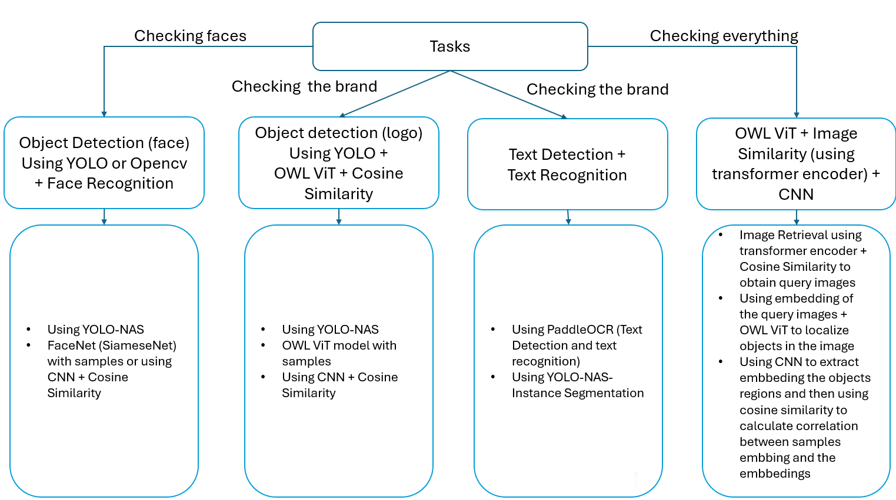
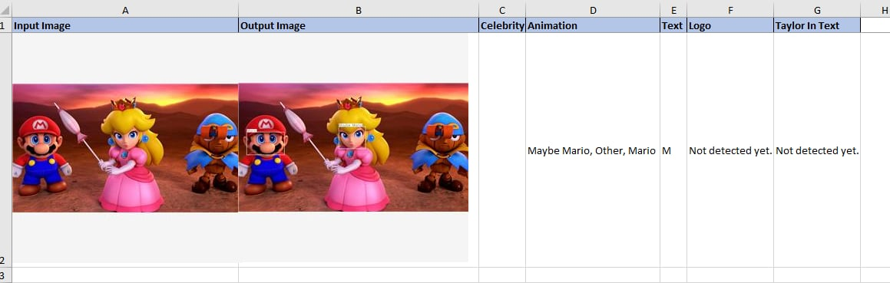

# Introduction

Built a website and trained a model to recognize famous brands, celebrities, and animated characters in images. The project aimed to create a user-friendly platform for image recognition, leveraging advanced computer vision techniques.

# Step By Step

# Result
[Link Results](Overall_Results.xlsx)

**Overall Accuracy:**
  * Total Accuracy: 77.1% (1710 correctly classified out of 2217)
  * Good Image Classification Accuracy: 77% (813/1056)
  * Rejected Image Classification Accuracy: 77.3% (896/1161)

**Accuracy for each category:**
  * Famous Celebrities: 84% (367/438)
  * Animations: 87% (229/264)
  * Logos: 66% (300/459)
  * Keyword-based Accuracy: 93% (2058/2217)

# Contribute
* **An Pham** - Data Engineer - [AnNePDHA](https://github.com/AnNePDHA)
  * Prepared and preprocessed image datasets using Roboflow for data augmentation and labeling, ensuring high-quality and diverse data inputs for improved model accuracy
  * Visualized model performance and results using Matplotlib, providing clear insights for further improvements
  * Conducted testing and validation of the model, refining it to achieve higher accuracy and reliability.
  * Integrated the trained model into a website using Python and Flask, making the recognition system accessible and user-friendly for end-users.
  * Using a system capable of recognizing celebrities, animated characters, and logos in images using Computer Vision libraries such as YOLO and Hugging Face models.
